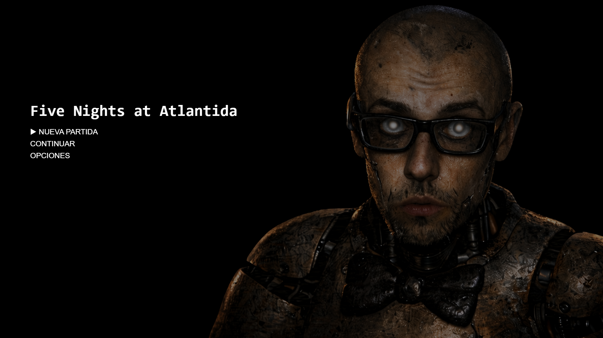
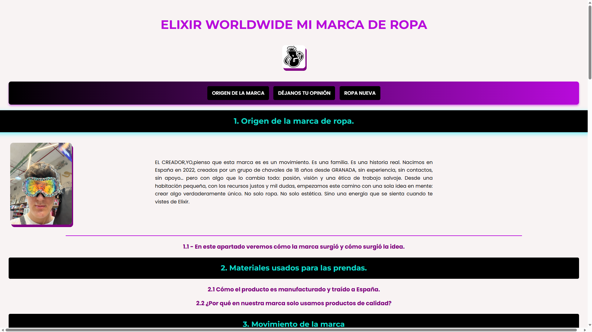
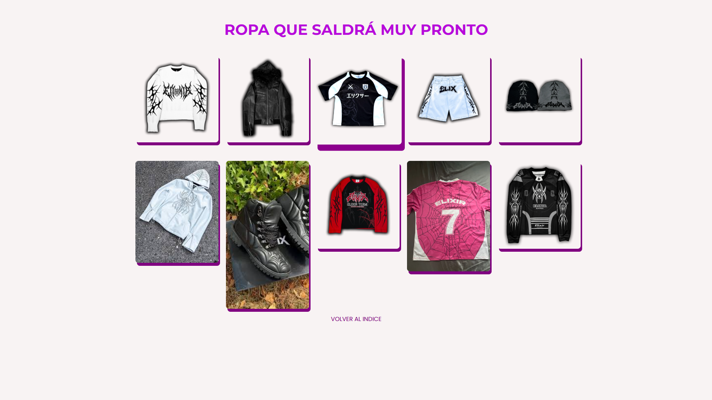

# 👨‍💻 Hugo Arboleda Rincón | DESARROLLADOR MULTIPLATAFORMA Y WEB

  

---

  
  

### 👨‍💻 Sobre mí
Soy estudiante de **Desarrollo de Aplicaciones Multiplataforma (DAM)**. Mi perfil combina la precisión de la **lógica matemática**, la sensibilidad del **arte** y una sólida base técnica en el desarrollo de software. Me apasiona construir soluciones que sean tan robustas por dentro como elegantes por fuera.🚀

* 🌍 **Idiomas:**
    * 🇪🇸 **Español:** Nativo
    * 🇬🇧 **Inglés:** B2 (Comunicación fluida)
    * 🇫🇷 **Francés:** A2 (Competencia básica)
* 🎯 **Enfoque actual:** Especializándome en arquitecturas escalables con Java y desarrollo web dinámico (HTML/CSS/JS).
* 🧠 **Filosofía:** "La programación es el arte de resolver problemas mediante la lógica aplicada".

---

### 🛠️ Stack Tecnológico

| Área | Tecnologías |
| :--- | :--- |
| **Backend** |  |
| **Frontend** |    |
| **Herramientas** |   |

---

### 📊 Mis Estadísticas de GitHub

  
  

---

### 🚀 Mis Proyectos Destacados

A continuación, muestro ejemplos de mi trabajo en desarrollo y diseño:

| Proyecto / Diseño | Captura de Pantalla |
| :--- | :--- |
| **Arquitectura de Software** Soluciones robustas en Java. |  |
| **Desarrollo Web (v1)** Interfaz limpia con HTML/CSS/JS. |  |
| **Desarrollo Web (v2)** Optimización de UX/UI. |  |

---

### 🎨 Valor Añadido
1.  **Mentalidad Analítica:** Gracias a mi base matemática, abordo los algoritmos y la estructura de datos con gran agilidad.
2.  **Visión Estética:** Como artista, cuido la experiencia de usuario (UX) y el diseño visual (UI) para que el software sea atractivo.
3.  **Perfil Internacional:** Capacidad para trabajar en entornos bilingües y colaborar con equipos diversos.
4.  **Formación DAM:** Enfoque práctico en el desarrollo de aplicaciones multiplataforma y gestión eficiente de sistemas.

---

### 📫 Contacto
Estoy abierto a
